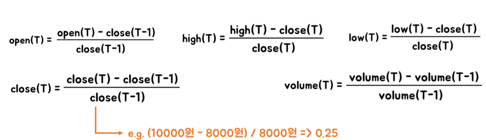
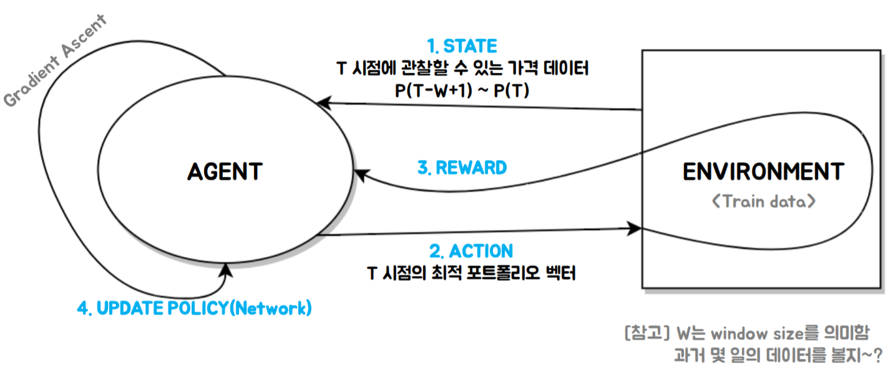
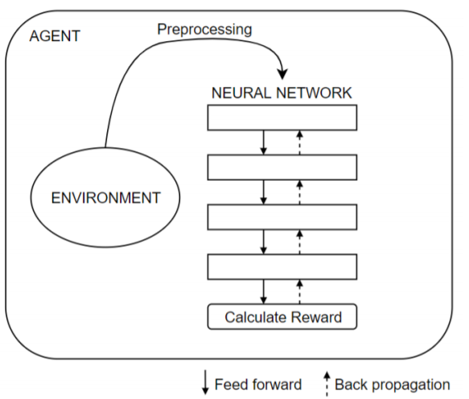
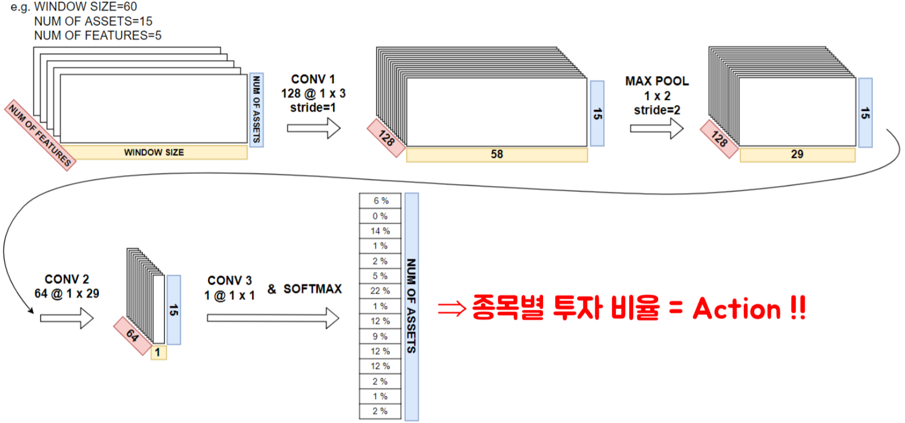
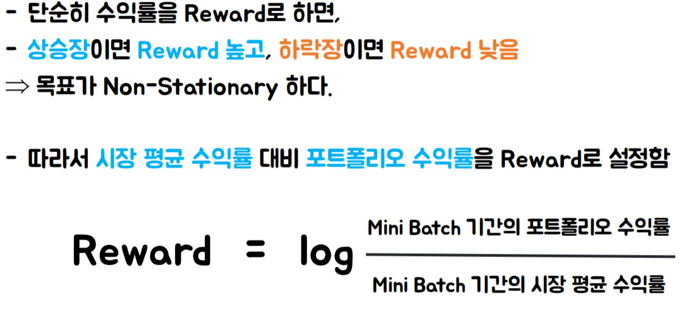
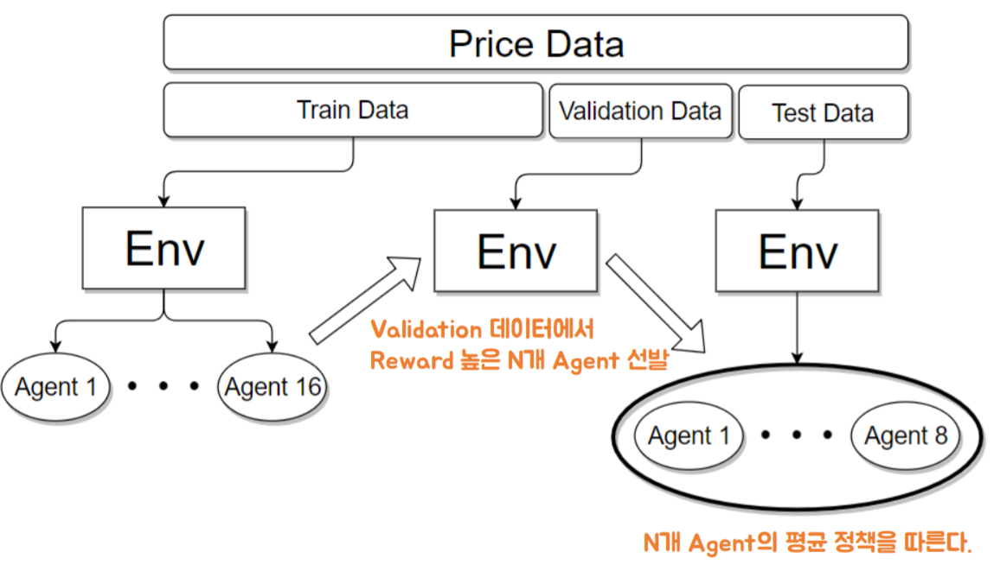
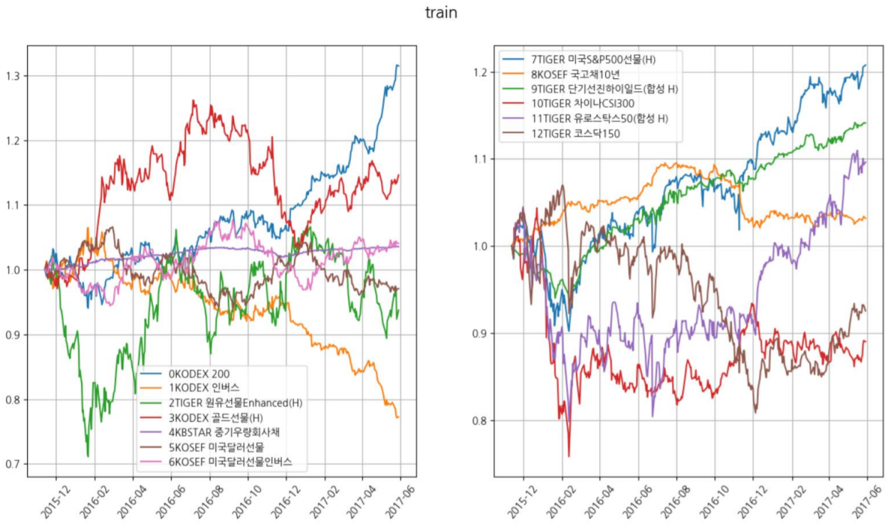
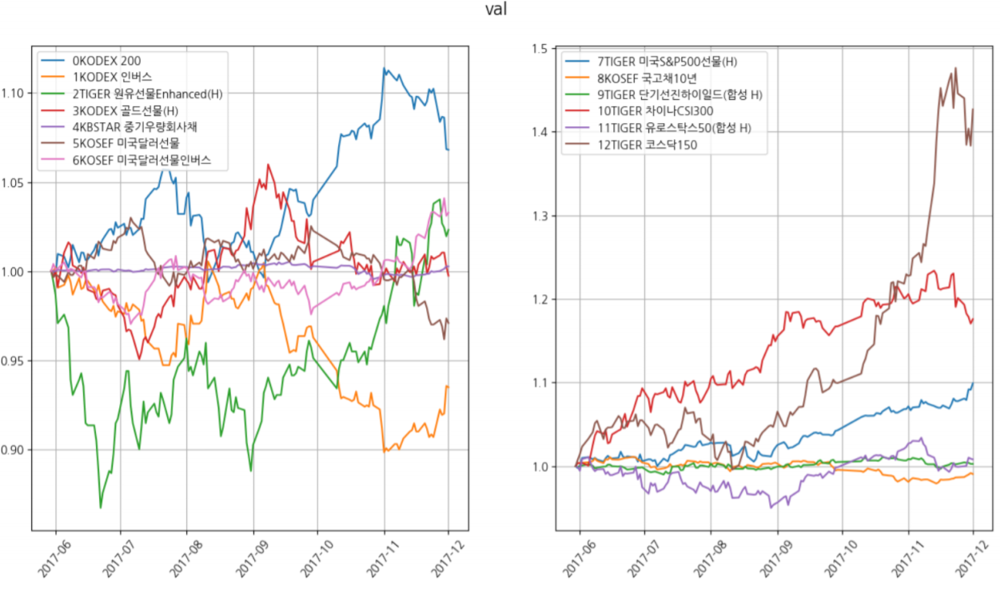
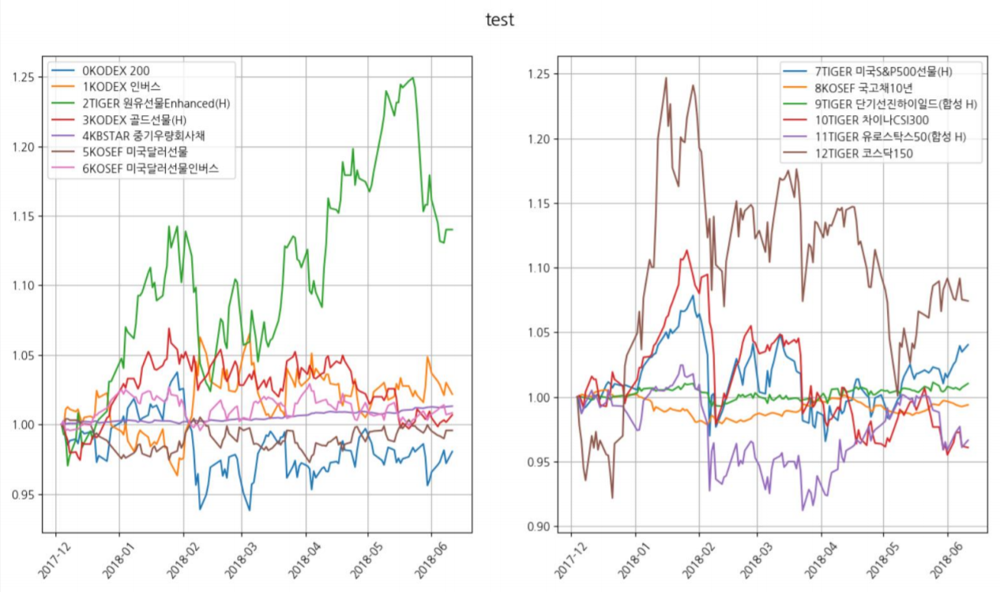
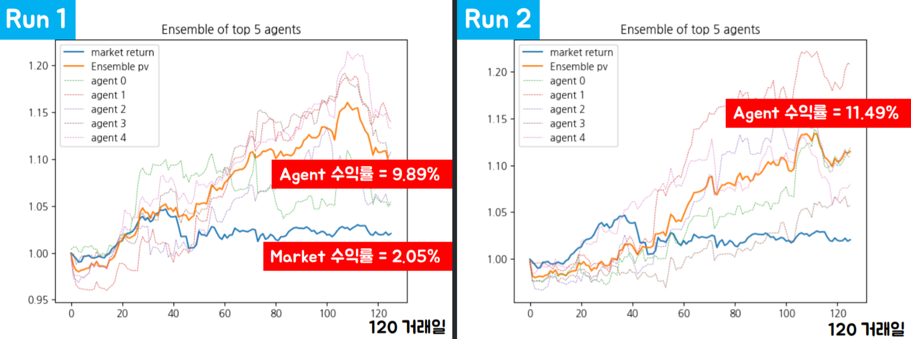

# Policy_Gradient_ETF_Portfolio_Manager

Deterministic Policy Gradient Algorithm을 이용하여 ETF 상품 포트폴리오를 구성하는 AI Agent 만들기!

발표자료=https://www.slideshare.net/KyusooHan/policy-gradient-etf

## Quick Start
```
> conda install tensorflow pandas matplotlib
> python main.py
```

## 데이터
ETF(Exchange-Traded Fund) 15개 종목

1. KODEX 200
2. TIGER 코스닥150
3. TIGER 미국S&P500선물(H)
4. TIGER 유로스탁스50(합성 H)
5. KINDEX 일본Nikkei225(H)
6. TIGER 차이나CSI300
7. KOSEF 국고채10년
8. KBSTAR 중기우량회사채
9. TIGER 단기선진하이일드(합성 H)
10. KODEX 골드선물(H)
11. TIGER 원유선물Enhanced(H)
12. KODEX 인버스
13. KOSEF 미국달러선물
14. KOSEF 미국달러선물인버스
15. KOSEF 단기자금

이 종목들의 open, high, low, close, volume이 기본 데이터임
위 15개 종목은 DB GAPS 투자대회에서 투자 대상 종목으로 사용하는 것과 동일함

데이터는 https://github.com/gyusu/Creon-Datareader를 이용해 얻을 수 있음
.db 파일 내용 쉽게 확인하려면 https://sqlitebrowser.org 받으면 된다

### 전처리

전처리 방식은 [3]에서 한 방식과 동일
## 강화학습 구조
### 개념적 구조

### 구현된 구조
사실 위 그림에서와 같은 Environment와 Agent간의 상호작용이 불필요함
Agent가 Action 취한다고 환경(가격정보)이 변하는 것이 아니기 때문 (no market power 가정)
그래서 아래 그림과 같이 Env를 통째로(..mini batch로 쪼개서 넣습니다) 넣어줘도 됨


## Agent 뇌 구조

기본적으로 구현한 뇌 구조는 [1]논문 구조와 매우매우 유사한 구조임
+ Convolution Layer 사이에 Dropout과 Noise 적용
+ 모든 Activation function은 ReLu
+ Adam Optimizer
+ Batch size = 30 (30일간의 시장 대비 수익률을 Maximize하는 방향으로
학습한다는 의미를 내포함) 코드 수정에 따라 30 아닐 수도 있음

## Reward 정의

참고로 Sharpe ratio, Information ratio도 구현되어있긴 하다. [1]에서는 Sharpe ratio 사용했다.
## 앙상블
#### 앙상블 왜 필요?
매 Run 마다 수렴하는 정책이 많이 다름. 그 결과, 수익률도 큰 분산을 갖게 됨.
Random Seed 때문
+ random seed 달라도 그렇지 결과가 너무 다른데..?
+ 수익률 좋은 포트폴리오 구성법은 무수히 많기 때문에, local maxima 정책이 매우 다양할 것이라고 생각함.
+ 특히 train data에 대해 overfitting하게 정책(weight, bias)을 업데이트 하는 유인이 강함.



## 테스트
```
데이터 기간 = 2015-11-13 ~ 2018-06-11
Train : Validation : Test = 0.6 : 0.2 : 0.2
종목 = 13개
```
#### 가정
1. Agent의 Action이 시장에 미치는 영향력 없음
2. 거래 수수료 및 세금 고려 안 함
3. Market 수익률은 투자 대상종목(13개)를 동일한 비중으로 보유했을 때의 수익률임

#### Train data

#### Validation data

#### Test data

#### 테스트 결과


## 혼잣말
질문 : 모든 기간에 대해 이렇게 좋습니까?
**답 : 아니요**
질문 : 그럼 좀 더 일반적인 결과를 보여주세요
**답 : 어떻게 테스트를 진행해야 할지 잘 모르겠어요. 생각 중이에요.**

## TODO
1. Rolling [Train & Validation & Test]
2. 수수료 반영

## Reference
[1] Z Jiang et al., A Deep Reinforcement Learning Framework for the Financial Portfolio Management Problem, 2017
[2] Y Deng et al., Deep Direct Reinforcement Learning for Financial Signal Representation and Trading, 2017
[3] 김문권, 파이썬과 케라스를 이용한 딥러닝/강화학습 주식투자, 2018
